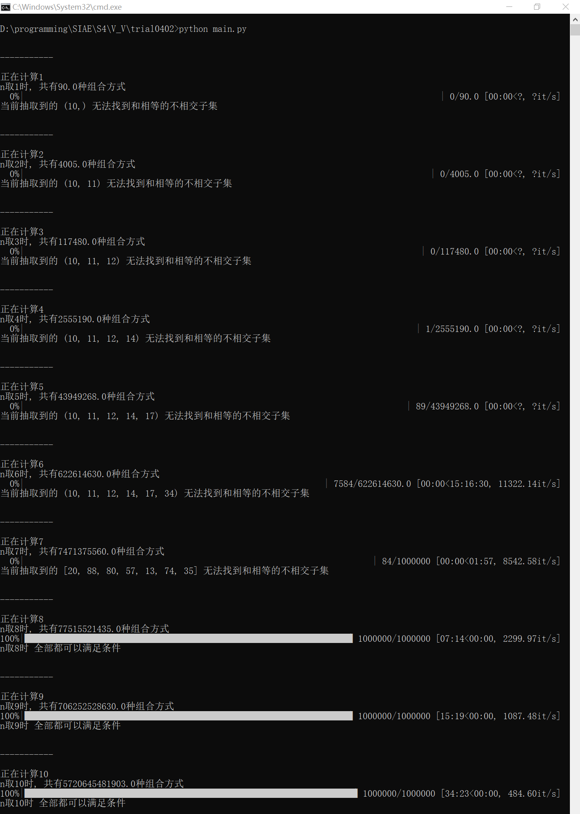

# 确认与验证 作业 Part 1

> 2022.04  原程序：Q30.m

## 程序目的

抽取n个不相同的两位数 (10~99)，验证这n个数组成的集合能找到两个不相交子集，其所有元素之和相等。

## 附加要求

假设抽取n个不相同的两位数，**总是**能找到两个元素之和相等的不相交子集，求n的最小值。

## 测试过程

1. 运行 `Q30.m`，输出如下：

   ```bash
   the set is 
       91    90    89    88    83    64    55    33    21    18
   
   one solution is:
       first subset is:
           55    33
   
       second subset is:
           88
   ```

2. 阅读代码，分析算法

   ```matlab
   n = 10;
   A = 10:99;
   random_num = A(randperm(numel(A),n));%随机选出10个2位数
   random_num = sort(random_num,'descend'); %排序
   disp('the set is ')
   disp(random_num)
   
   indx = ff2n(n);
   S = zeros(1,2^n);
   for k = 1:2^n
       S(k) = sum(random_num(boolean(indx(k,:))));
   end
   [S2,indx2] = sort(S);
   k = 1;
   stop_flag = 1;
   while stop_flag
       if S2(k) == S2(k+1)
           hasInterSet = max(indx(indx2(k),:) + indx(indx2(k+1),:));
           if hasInterSet<2
               disp('one solution is:')
               disp('first subset is:')
               disp(random_num(boolean(indx(indx2(k),:))))
               disp('second subset is:')
               disp(random_num(boolean(indx(indx2(k+1),:))))
               stop_flag = 0;
           else
               k = k+1;
           end
       else
           k = k+1;
           if k == 2^n
               stop_flag = 0;
               disp('can not find the sub sets');
           end
       end
   end
   ```

3. 分别在第 `8`、`13`、`18`、`27`行设置断点，在断点处查看变量是否符合预期。

4. 根据分析结果，优化代码。

5. 重复步骤三，直至程序运行情况符合预期。

6. 将 `Q30.m` 程序封装为一个函数，调用该函数，重复执行，直至出现某一次找不到和相等的两个不相交子集，此时判定该n不满足条件；或到达重复次数上限，上限为1000000 次，此时判定该n符合条件。

7. 更改 `n` 的值，从初始值10开始，以步长1递减，重复执行上一步骤。

8. 根据上一步骤，找到满足要求的最小的n 。


## 优化

1. 第 `26-27` 行的条件分支冗余，`hasInterSet<2` 恒成立。

   1. 实验现象：设置于第 `27` 行的断点，在超过**3000000次**运行过程中均未触发。
   2. 理论依据：任何求和相等的相交子集对，都能找到其对应的、前置的求和相等的不相交子集对，而这个前置子集对被找到时，程序即已停止迭代。

   
   
   
   
2. 第 `15` 行 `stop_flag` 建议更改为 `continue_flag`，更加符合变量功能。


## 测试结果

满足条件的n最小为8 。


